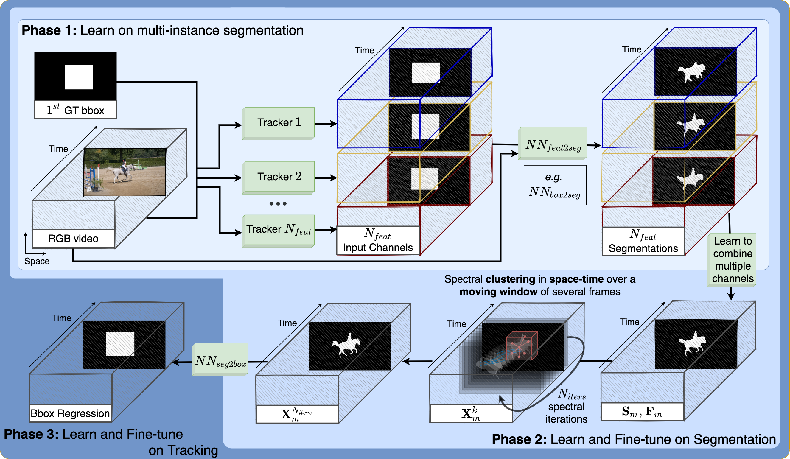

# SFTrack++

* **Title**: SFTrack++: A Fast Learnable Spectral Segmentation Approach for Space-Time Consistent Tracking
* **Author**: Elena Burceanu
* **Paper** (published at NeurIPS 2020 Workshop on Pre-registration, PMLR 2021) https://proceedings.mlr.press/v148/burceanu21a
* [Presentation](resources/sftrack++.pdf)

We propose an object tracking method, SFTrack++, that smoothly learns to preserve the tracked object consistency over space and time dimensions by taking a spectral clustering approach over the graph of pixels from the video, using a fast 3D filtering formulation for finding the principal eigenvector of this graph's adjacency matrix. To better capture complex aspects of the tracked object, we enrich our formulation to multi-channel inputs, which permit different points of view for the same input. The channel inputs are in our experiments, the output of multiple tracking methods. After combining them, instead of relying only on hidden layers representations to predict a good tracking bounding box, we explicitly learn an intermediate, more refined one, namely the segmentation map of the tracked object. This prevents the rough common bounding box approach to introduce noise and distractors in the learning process. We test our method, SFTrack++, on five tracking benchmarks: OTB, UAV, NFS, GOT-10k, and TrackingNet, using five top trackers as input. Our experimental results validate the pre-registered hypothesis. We obtain consistent and robust results, competitive on the three traditional benchmarks (OTB, UAV, NFS) and significantly on top of others (by over $1.1\%$ on accuracy) on GOT-10k and TrackingNet, which are newer, larger, and more varied datasets.

<p float="left">
  
</p>


# Running the code
### 1. Copy from [pytracking](https://github.com/visionml/pytracking) in sftrackpp root:
* `ltr/data`
* `pytracking/pytracking`

### 2. Run sftrackpp phases
`python phase1.py`
`python phase2.py`
`python phase3.py`

# Please refer to it as:
```
@InProceedings{pmlr-v148-burceanu21a,
  title = 	 {SFTrack++: A Fast Learnable Spectral Segmentation Approach for Space-Time Consistent Tracking},
  author =       {Burceanu, Elena},
  booktitle = 	 {NeurIPS 2020 Workshop on Pre-registration in Machine Learning},
  year = 	 {2021}
}
```
